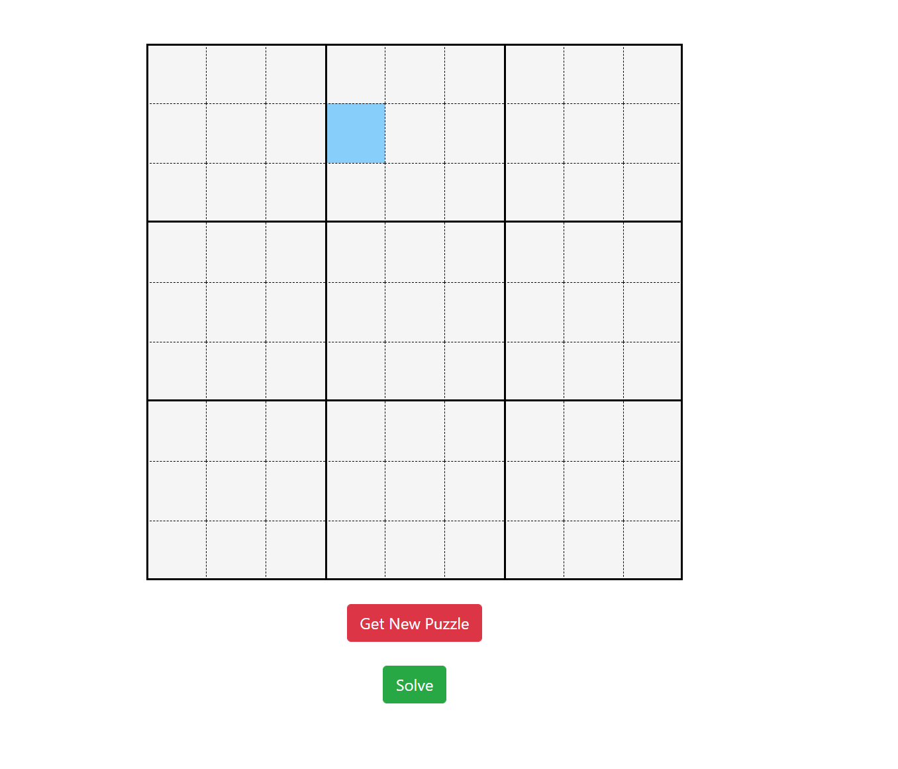
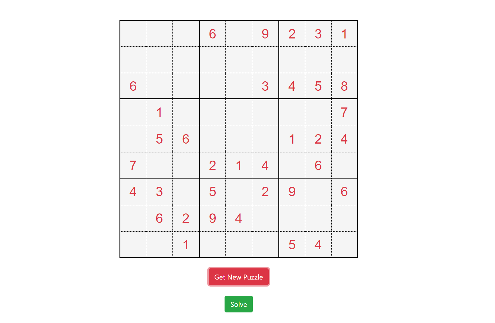
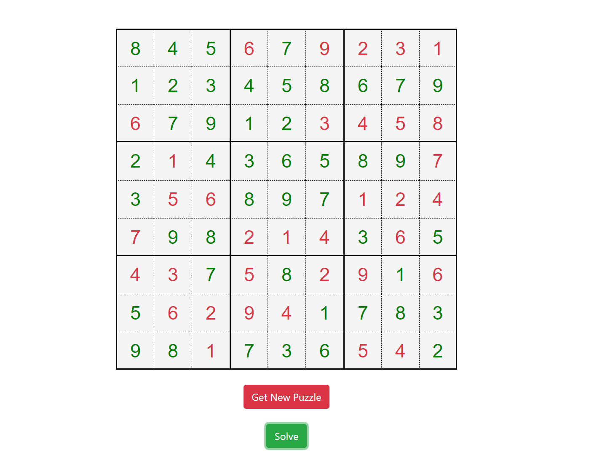

# Sudoku-solver-web-app

A mini project basically designed to solve sudoku puzzles

## Languages used
1. HTML
2. JS
3. CSS

### General Info
***
Used basically concept of Backtracking.

Live Demo of project - (https://crkodervro.github.io/Sudoku/)
***

## AppPreview

### Initial Preview

  

### Generate Puzzle

  

### Solve Puzzle

  

